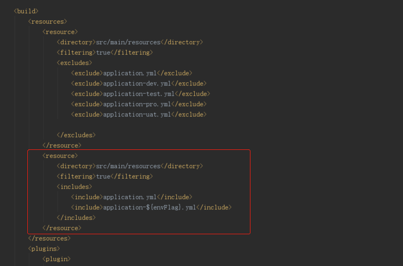
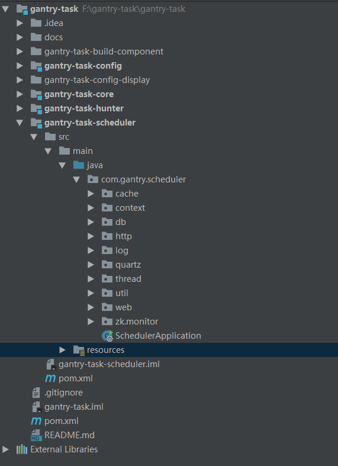
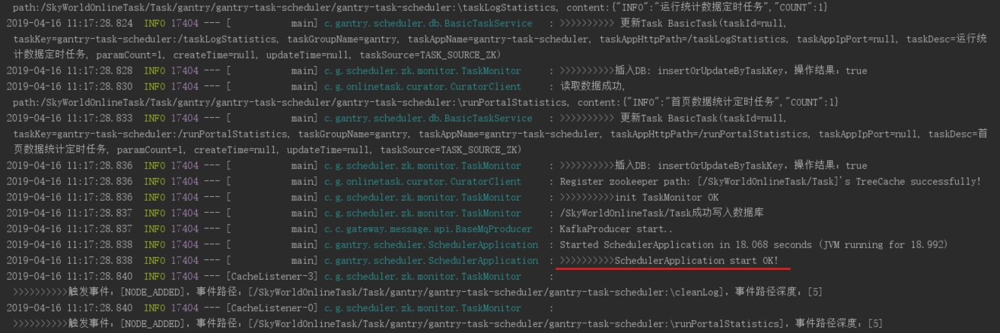
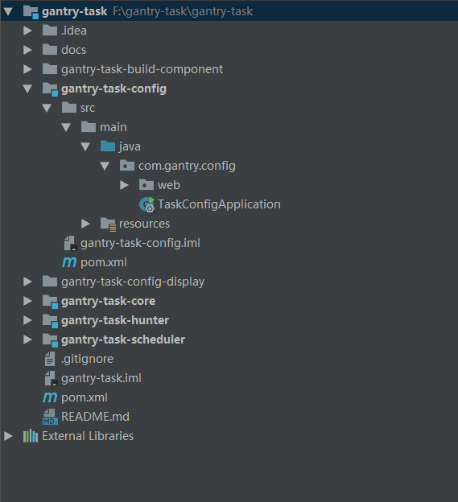
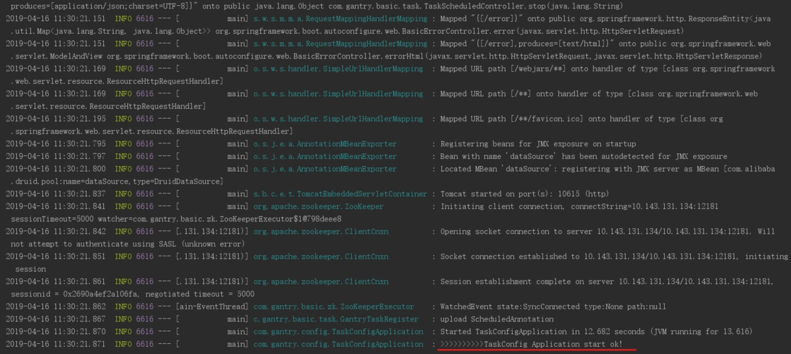
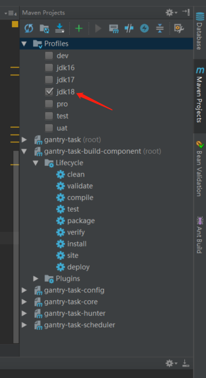
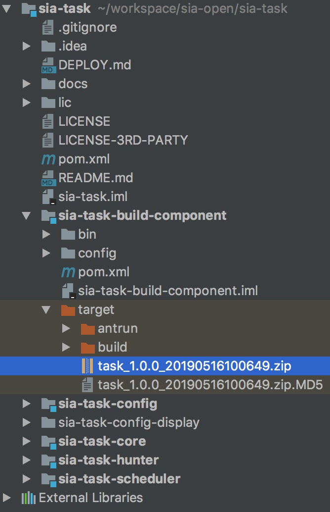

微服务任务调度平台部署指南
=======

## MySQL部署 

### MySQL安装

MySQL的安装和配置这里不再赘述，详见MySQL官方文档

### 微服务任务调度平台DB初始化

```sql


-- ----------------------------
-- database sia_task
-- ----------------------------

create database IF not exists `skyworld_task`;

use skyworld_task;

-- ----------------------------
-- Table structure for skyworld_basic_job
-- job 元数据 手动录入
-- ----------------------------
create table if not exists skyworld_basic_job
(
  job_id           int auto_increment,
  job_key          varchar(255) not null comment '除ID外的 唯一标识 KEY',
  job_group        varchar(100) not null comment '命名空间：name+group组成一个唯一key',
  job_triger_type  varchar(25)  null comment '触发器类型',
  job_triger_value varchar(128) null comment '触发器类型值',
  job_desc         varchar(250) null comment 'job描述信息',
  job_alarm_email  varchar(100) null comment 'job预警邮箱',
  job_create_time  datetime     not null,
  job_update_time  datetime     not null,
  job_parent_key   varchar(255) null comment 'job父jobKey',
  job_plan         varchar(255) null comment 'job级联',
  constraint job_id_UNIQUE
    unique (job_id),
  constraint job_key_UNIQUE
    unique (job_key)
)
  charset = utf8;

alter table skyworld_basic_job
  add primary key (job_id);

-- ----------------------------
-- Table structure for skyworld_basic_task
-- task 元数据 自动获取/手动录入
-- ----------------------------
create table if not exists skyworld_basic_task
(
  task_id            int auto_increment,
  task_key           varchar(255)     not null comment '唯一键-检索使用(AppName+HttpPath)',
  task_group_name    varchar(255)     not null comment 'task_group_name',
  task_app_name      varchar(255)     not null comment 'app_name',
  task_app_http_path varchar(255)     not null comment 'task请求路径',
  task_app_ip_port   varchar(255)     null comment 'app实例IP:port',
  param_count        int(2) default 1 null comment '是否存在入参：0：没有，1：存在',
  taskDesc           varchar(255)     null comment 'task描述',
  task_source        varchar(45)      null comment 'task来源。TASK_SOURCE_UI：手动录入，TASK_SOURCE_ZK：自动抓取',
  create_time        datetime         not null,
  update_time        datetime         null,
  constraint task_id_UNIQUE
    unique (task_id),
  constraint task_key_UNIQUE
    unique (task_key)
)
  charset = utf8;

alter table skyworld_basic_task
  add primary key (task_id);

-- ----------------------------
-- Table structure for skyworld_job_log
-- job—log 日志表，Job 调度日志
-- ----------------------------
create table if not exists skyworld_job_log
(
  job_log_id               int auto_increment comment '主键ID AUTO_INCREMENT'
    primary key,
  job_id                   int           not null,
  job_trigger_code         varchar(45)   null comment '调度-结果状态',
  job_trigger_msg          varchar(2048) null comment '调度-日志',
  job_trigger_time         datetime      null comment '调度-时间',
  job_handle_code          varchar(45)   null comment '执行结果-状态',
  job_handle_msg           varchar(2048) null comment '执行结果-日志',
  job_handle_time          datetime      null comment '执行-时间',
  job_handle_finished_time datetime      null comment '执行完成时间',
  create_time              datetime      null
)
  charset = utf8;

-- ----------------------------
-- Table structure for skyworld_portal_stat
-- sia-task 统计表，监控使用
-- ----------------------------
create table if not exists skyworld_portal_stat
(
  portal_statistics_id int auto_increment
    primary key,
  scheduler            varchar(2048) not null comment '调度器IP:PORT',
  job_call_count       int           not null comment 'JOB调度次数',
  task_call_count      int           not null comment 'task调度次数',
  job_exception_count  int           not null comment 'JOB异常数量',
  job_finished_count   int           not null comment 'JOB已完成数量',
  task_exception_count int           not null comment 'task异常数量',
  task_finished_count  int           not null comment 'task已完成数量',
  last_time            datetime      not null comment '上次统计时间',
  create_time          datetime      not null
)
  charset = utf8;;

-- ----------------------------
-- Table structure for skyworld_task_log
-- task-log 日志表，task 调度日志
-- ----------------------------
create table if not exists skyworld_task_log
(
  task_log_id        int auto_increment
    primary key,
  job_log_id         int           not null comment 'task计数;',
  job_key            varchar(255)  null,
  task_key           varchar(255)  not null comment 'task_id',
  task_msg           varchar(2048) null comment '状态描述信息,如：异常信息，SUCCESS等',
  task_status        varchar(45)   null comment '状态值：ready,running,finished,exception',
  task_handle_time   datetime      null,
  task_finished_time datetime      null,
  create_time        datetime      null
)
  charset = utf8;

-- ----------------------------
-- Table structure for task_mapping_job
-- 编排关系 job-task 关系表
-- ----------------------------
create table if not exists task_mapping_job
(
  task_map_job_id int auto_increment
    primary key,
  job_id          int                                      not null,
  job_key         varchar(255)                             not null,
  job_group       varchar(255)                             not null,
  task_id         int                                      not null,
  task_key        varchar(255)                             not null,
  pre_task_key    varchar(255)                             null comment '前置任务',
  input_type      varchar(255) default 'from_ui'           not null comment 'task入参来源：{from_ui,from_task}',
  input_value     varchar(255)                             null comment 'task入参参数值',
  route_strategy  varchar(45)  default 'ROUTE_TYPE_RANDOM' null comment '路由策略{ROUTE_TYPE_FIRST,ROUTE_TYPE_RANDOM,ROUTE_TYPE_LAST,ROUTE_TYPE_ROUND}',
  failover        varchar(45)                              null comment '失败恢复策略',
  fix_ip          varchar(45)                              null comment '预估执行时间',
  update_time     datetime                                 null comment '更新时间',
  create_time     datetime                                 not null comment '创建时间',
  read_timeout    int                                      null comment '接口数据返回超时时间',
  constraint uni_ind_job_task_id
    unique (job_key, job_group, task_key)
)
  charset = utf8;


```

## Zookeeper部署 

###  搭建zookeeper环境（准备工作）
生产建议至少使用三个节点作为zk集群

假设集群节点IP：100 - 101 - 102

分别在三个节点上面执行如下命令：

#### 命令1：切换app用户
```shell
命令1：切换app用户
[root@localhost ~]# su app(看生产实际情况，需否)
[app@localhost yxgly]$
```
#### 命令2：创建路径
```shell
命令2：创建路径
[root@localhost ~]# cd /app/
[root@localhost app]# mkdir zookeeper
[root@localhost app]# cd zookeeper/
```
#### 命令3：上传zookeeper 安装包
```shell
命令3：上传zookeeper 安装包
[root@localhost zookeeper]# rz 
zookeeper-3.4.6.tar.gz
```
#### 命令4：解压缩
```shell
命令4：解压缩
[root@localhost zookeeper]# tar -zxvf zookeeper-3.4.6.tar.gz 
[root@localhost zookeeper]# ll
total 17292
drwxr-xr-x 10 app  app      4096 Feb 20  2014 zookeeper-3.4.6
-rw-r--r--  1 root root 17699306 Aug 27  2015 zookeeper-3.4.6.tar.gz
```
#### 命令5：创建data log路径
```shell
[root@localhost zookeeper]# mkdir -p zookeeperdata/data
[root@localhost zookeeper]# mkdir -p zookeeperdata/log
```

#### 命令6：修改配置文件
```shell
[root@localhost zookeeper]# cd zookeeper-3.4.6/conf/
[root@localhost conf]# ll
total 12
-rw-rw-r-- 1 app app  535 Feb 20  2014 configuration.xsl
-rw-rw-r-- 1 app app 2161 Feb 20  2014 log4j.properties
-rw-rw-r-- 1 app app  922 Feb 20  2014 zoo_sample.cfg
[root@localhost conf]# cp zoo_sample.cfg zoo.cfg

[root@localhost log]# mkdir -p zookeeperdata/data
[root@localhost conf]# vi zoo.cfg 
```
修改内容如下 zoo.cfg 
```txt
tickTime=2000
# The number of ticks that the initial
# synchronization phase can take
initLimit=10
# The number of ticks that can pass between
# sending a request and getting an acknowledgement
syncLimit=5
# the directory where the snapshot is stored.
dataDir=/app/zookeeper/zookeeperdata/data
dataLogDir=/app/zookeeper/zookeeperdata/log
# the port at which the clients will connect
clientPort=2181
     
server.1=*.*.*.100:2888:3888
server.2=*.*.*.101:2888:3888
server.3=*.*.*.102:2888:3888

```
说明
```txt
*   tickTime=2000
	tickTime这个时间是作为Zookeeper服务器之间或客户端与服务器之间维持心跳的时间间隔，也就是每个tickTime时间就会发送一个心跳；
*   initLimit=10
	initLimit这个配置项是用来配置Zookeeper接受客户端（这里所说的客户端不是用户连接Zookeeper服务器的客户端，而是Zookeeper服务器集群中连接到Leader的Follower 服务器）初始化连接时最长能忍受多少个心跳时间间隔数。 当已经超过10个心跳的时间（也就是tickTime）长度后 Zookeeper 服务器还没有收到客户端的返回信息，那么表明这个客户端连接失败。总的时间长度就是 10*2000=20 秒
*   syncLimit=5
	syncLimit这个配置项标识Leader与Follower之间发送消息，请求和应答时间长度，最长不能超过多少个tickTime的时间长度，总的时间长度就是5*2000=10秒；
*   dataDir=/export/search/zookeeper-cluster/zookeeper-3.4.6-node1/data
	dataDir顾名思义就是Zookeeper保存数据的目录，默认情况下Zookeeper将写数据的日志文件也保存在这个目录里；
*   clientPort=2181
	clientPort这个端口就是客户端连接Zookeeper服务器的端口，Zookeeper会监听这个端口接受客户端的访问请求；
*   server.A=B:C:D
	server.1=localhost:2887:3887
	server.2=localhost:2888:3888
	server.3=localhost:2889:3889
A是一个数字，表示这个是第几号服务器； B是这个服务器的ip地址； C第一个端口用来集群成员的信息交换，表示的是这个服务器与集群中的Leader服务器交换信息的端口； D是在leader挂掉时专门用来进行选举leader所用。
```

#### 命令7 创建ServerID标识
除了修改zoo.cfg配置文件，集群模式下还要配置一个文件myid，这个文件在dataDir目录下，这个文件里面就有一个数据就是A的值，在上面配置文件中zoo.cfg中配置的dataDir路径中创建myid文件
```shell
[root@localhost data]# cd /app/zookeeper/zookeeperdata/data/
[root@localhost data]# vi myid
```
！注意！
节点的myid 分别为:
```txt
 100 -> 1
 101 -> 2
 102 -> 3
```
#### 命令8 逐个启动新节点实例
在三个节点上均执行完毕后；
启动zookeeper命令
```shell
bin/zkServer.sh start
```
#### 命令9 检测集群是否启动
```shell
bin/zkCli.sh -server IP:2181
bin/zkCli.sh

查看ZK服务状态:       sh bin/zkServer.sh status
```

## 前端部署启动 

### 前言

该项目基于node环境运行，如未安装node，请先安装node

传送门：https://nodejs.org/en/download/

### 技术栈

vue2 + vuex + vue-router + webpack + ES6 + less + axios + element-ui

### 项目运行

npm install 或 cnpm install(推荐)

注：CNPM 为淘宝镜像 如未安装，传送门：HTTP://NPM.TAOBAO.ORG/
npm run dev

访问: http://localhost:8083

### 项目打包

npm run build

注：可以更改DIST/STATIC文件夹下面的SITE.MAP.JS文件进行环境的配置（IP：PORT形式）
1、CESHI_API_HOST -> 后端服务地址

2、CESHI_API_HOST_LOG -> kabana 日志连接地址


## 编排中心和调度中心部署 

### 环境要求

系统：64bit OS，Linux/Mac/Windows

开发IDE：推荐使用IntelliJ IDEA 或 Eclipse

JDK：JDK1.8+

Mysql：详见MySQL部署

zookeeper: 可单点、集群安装，详见Zookeeper部署（这里给出Linux下集群安装方法）

### 一、源码启动项目

本节主要说明如何快速搭建SIA-TASK微服务任务调度平台的开发环境以及从源码启动项目。

#### 源码启动项目说明

SIA-TASK微服务任务调度平台可以在Windows、Mac、Linux系统下进行开发，由于我们一般使用IDE进行开发工作，三个系统下的开发流程类似，这里仅以 Windows平台 进行详细介绍项目导入及启动过程。

SIA-TASK微服务任务调度平台源码启动-Windows:

1、[源码下载](https://github.com/siaorg/sia-task.git)

有两种方式将源码导入IDE环境：

* 按照给出的源码下载地址下载源码，通过IDE从本地导入；

* 使用IDE通过源码地址从版本控制仓库进行导入。

2、配置文件说明

SIA-TASK微服务任务调度平台需要启动的后端进程有两个：`sia-task-config`和`sia-task-scheduler`。下面以open环境配置文件为例，详细介绍这两个进程的配置文件的配置。

(1) sia-task-config

sia-task-config工程dev环境下的配置文件为application-open.yml，修改方式如下：

sia-task-config工程配置文件修改

```
spring.application.name: sia-task-config
server.port: 10615
spring.application.cnname: 任务编排中心

#############################################################
############## zooKeeperHosts config ########################
#############################################################
zooKeeperHosts: 127.0.0.2:2181,127.0.0.3:2181,127.0.0.4:2181

#############################################################
############## DB config ####################################
#############################################################
spring:
    datasource:
        name: test
        url: jdbc:mysql://127.0.0.1:3306/skyworld_task?useUnicode=true&characterEncoding=utf8&allowMultiQueries=true
        username: ****
        password: ****
        # 使用druid数据源
        type: com.alibaba.druid.pool.DruidDataSource
        driver-class-name: com.mysql.jdbc.Driver
        filters: stat
        maxActive: 20
        initialSize: 1
        maxWait: 60000
        minIdle: 1
        timeBetweenEvictionRunsMillis: 60000
        minEvictableIdleTimeMillis: 300000
        validationQuery: select 'x'
        testWhileIdle: true
        testOnBorrow: false
        testOnReturn: false
        poolPreparedStatements: true
        maxOpenPreparedStatements: 20

#############################################################
############## mybatis config ###############################
#############################################################
mybatis:
  mapper-locations: classpath:mappers/*.xml
  type-aliases-package: com.sia.core.entity
#
pagehelper:
  helper-dialect: mysql
  reasonable: true
  support-methods-arguments: true
  params: countSql

logging.file: ./logs/${spring.application.name}.log


#address.kibana: 10.143.131.86:5601
```

需要修改的配置项主要有以下两个：

* zooKeeperHosts：自身环境的zookeeper服务地址ip:port

* Mysql：配置自身环境Mysql的url、username和password


(2) sia-task-scheduler

sia-task-scheduler工程dev环境下的配置文件为application-open.yml，修改方式如下：

sia-task-scheduler工程配置文件修改

```
spring.application.name: sia-task-scheduler
spring.application.cnname: 任务调度中心
#应用端口号
server.port: 11272
#配置报警邮箱，当该服务出现问题后会触发报警(建议配置成组邮箱)，如下：
eureka.instance.metadataMap.alarmEmail: **@**

#开启全信息展示，默认值为true，不展示所有信息
#endpoints.health.sensitive: false
#management.security.enabled: false

#############################################################
############## eureka config ################################
#############################################################
eureka.client.serviceUrl.defaultZone: http://*.*.*.12:19002/eureka/,http://*.*.*.134:19002/eureka/
# 注册时使用ip而不是主机名
eureka.instance.preferIpAddress: true
# ${spring.cloud.client.ipAddress} 为IP地址
eureka.instance.instance-id: ${spring.cloud.client.ipAddress}:${server.port}

#############################################################
############## zooKeeperHosts config ########################
#############################################################
zooKeeperHosts: 127.0.0.2:2181,127.0.0.3:2181,127.0.0.4:2181

#############################################################
############## DB config ####################################
#############################################################
spring:
    datasource:
        name: test
        url: jdbc:mysql://127.0.0.1:3306/skyworld_task?useUnicode=true&characterEncoding=utf8&allowMultiQueries=true
        username: ****
        password: ****
        # 使用druid数据源
        type: com.alibaba.druid.pool.DruidDataSource
        driver-class-name: com.mysql.jdbc.Driver
        filters: stat
        maxActive: 20
        initialSize: 1
        maxWait: 60000
        minIdle: 1
        timeBetweenEvictionRunsMillis: 60000
        minEvictableIdleTimeMillis: 300000
        validationQuery: select 'x'
        testWhileIdle: true
        testOnBorrow: false
        testOnReturn: false
        poolPreparedStatements: true
        maxOpenPreparedStatements: 20


#############################################################
############## mybatis config ###############################
#############################################################
mybatis:
  mapper-locations: classpath:mappers/*.xml
  type-aliases-package: com.sia.core.entity

#############################################################
############## email config #################################
#############################################################
# 预警邮件配置
#whether send alarm email
SKYTRAIN_DEFAULT_EMAIL:
#邮件服务地址：*.*.*.69:12026,*.*.*.47:12026
EMAIL_SERVICE_REQUESTPATH: http://127.0.0.1:10101/sendMail

# 调度器执行的JOB个数阈值，超过则通知添加资源
onlinetask.job.alarm.threshold: 100
# 负载均衡的级别
onlinetask.job.fault.tolerant: 4

#############################################################
############## log config ###################################
#############################################################
logging.file: ./logs/${spring.application.name}.log

# Kafka server:port
#生产环境请配置：域名1:9092,域名2:9092,域名:9092 （支持多个域名:端口号配置）

spring.kafka.bootstrap-servers: *.*.*.12:9092

# 生产者和消费者topic前缀
spring.kafka.topicPrefix: sia-task-scheduler

spring.kafka.producer.enable: true
spring.kafka.producer.retries: 2
# 每次批量发送消息的数量
spring.kafka.producer.batch-size: 16384
spring.kafka.producer.buffer-memory: 33554432
# 指定消息key和消息体的编码方式
spring.kafka.producer.key-serializer: org.apache.kafka.common.serialization.StringSerializer
spring.kafka.producer.value-serializer: org.apache.kafka.common.serialization.StringSerializer
```

本配置文件需要修改的配置项有以下三个：

* zooKeeperHosts：zookeeper服务地址ip:port

* Mysql：自身环境Mysql的url、username和password

* 邮箱配置：当JOB发生异常时发送预警邮件给相关人员

    SKYTRAIN_DEFAULT_EMAIL：默认收件人邮箱，可以为空
    
    EMAIL_SERVICE_REQUESTPATH：邮件服务接口。
    
    * 需提供的邮件服务接口格式如：http://127.0.0.1:10101/sendMail
        
    * 邮件服务接口需处理的字段如下所示：
    
        ```
        class MailFormat{
        
            /**  邮件主题 */
            private String subject;
        
            /** 预警邮箱，用逗号(,)分隔 */
            private String[] mailto;
        
            /** 邮件正文 */
            private String content;
        
            /** 压制关键字 */
            private String primary;
        
            /** 压制时间，单位：毫秒 */
            private Long elapse;
        }
        ```
        其中，请求方法为POST，subject、mailto、content、primary和elapse将以json格式发送到邮件服务接口，在提供的邮件服务接口中，需接受并处理这些字段。


3、启动项目

启动项目之前，检查确认`sia-task-scheduler`和`sia-task-config`两个工程的配置是否正确，检查的内容如下图红框中所示：



确保在`sia-task-scheduler`和`sia-task-config`两个工程pom文件中的红框内容不被注释掉。

检查完毕后，分别启动`sia-task-scheduler`和`sia-task-config`两个springboot工程，启动方式如下：

* 启动`sia-task-scheduler`工程

    (1) 在源码中找到SchedulerApplication启动类，如下图所示：

    

    (2) 选中SchedulerApplication启动类，右键点击，在弹出框中选择`Run 'SchedulerApplication'` 或 `Debug 'SchedulerApplication'`(以调试模式启动)
    
    (3) 启动后若输出内容`>>>>>>>>>>SchedulerApplication start OK!`，则表示启动成功,如下图所示。
    
    

* 启动`sia-task-config`工程

    (1) 在源码中找到TaskConfigApplication启动类，如下图所示：
    
    
    
    (2) 选中TaskConfigApplication启动类，右键点击，在弹出框中选择`Run 'TaskConfigApplication'` 或 `Debug 'TaskConfigApplication'`(以调试模式启动)
    
    (3) 启动后若输出内容`>>>>>>>>>>TaskConfig Application start ok!`，则表示启动成功,如下图所示。
    
    

4、启动前端项目

启动前端项目有两种方式：

* 单独部署启动，详见[前端部署启动文档](install-front-end.md)；

* 置于`sia-task-config`工程中启动。

    (1) 将获取的前端包解压，得到`static`目录和`index.html`文件，修改`static`目录下的site-map.js文件的`CESHI_API_HOST`配置，如下所示：
    
    ```
    (function () {
      window.API = {
        'CESHI_API_HOST': 'localhost:10615',//修改为部署sia-task-config工程的节点的IP地址和工程启动端口号，这是sia-task微服务任务调度平台的访问入口
        'CESHI_API_HOST_LOG': 'localhost:5601'
      }
      Object.freeze(window.API)
      Object.defineProperty(window, 'API', {
        configurable: false,
        writable: false
      })
    })()
    ```
    
    (2) 在sia-task-config工程中resources目录下新建名为static的目录，将(1)中获得的`static`目录和`index.html`文件放到新建的static目录中；
    
    (3) 启动`sia-task-config`工程时，前端工程也随即启动。

这两种前端启动方式均需提前将前端包中`site-map.js`文件的`CESHI_API_HOST`配置进行修改。

5、访问项目

访问sia-task微服务任务调度平台的访问入口(登录页面地址：http://localhost:10615 )。登录页面如下图所示：


输入用户名/密码即可登录（此处没做用户名/密码登录限制，任意字符串的用户名/密码都能登录。登录时选择"是否是管理员"选项后，则会以管理员身份登录）。微服务任务调度菜单项如下图所示：


在该页面中，即可对SIA-TASK微服务任务调度的功能进行操作。


### 二、JAR包部署启动

本节主要说明如何在机器节点上以JAR包方式搭建SIA-TASK微服务任务调度平台系统，目前提供的安装版本为1.0.0。

#### JAR包部署启动说明

SIA-TASK微服务任务调度平台在机器节点上的部署启动非常简单方便。这里提供 Linux平台 下的项目部署方式。

SIA-TASK微服务任务调度平台Linux下JAR包部署启动:

下面介绍SIA-TASK微服务任务调度平台在Linux下以JAR包方式进行部署启动的步骤，这里以部署open环境为例。

1、安装包获取

有两种方式可以获取项目安装包：

(1) 在github源码中获取已经打包好的项目安装包，获取地址: https://github.com/siaorg/sia-task 

(2) 从源码打包获取安装包。基本步骤如下：

* 项目源码导入IDE：

    * 按照给出的[源码下载地址](https://github.com/siaorg/sia-task.git)下载源码，通过IDE从本地导入；

    * 使用IDE通过源码地址从版本控制仓库进行导入。

* pom.xml修改：注释掉`sia-task-config`和`sia-task-scheduler`项目pom.xml中关于配置文件打包的配置，见下图：

    

* 使用maven工具打包：

    * 在IDE(以IntelliJ IDEA为例)中打开Maven Projects面板，如下图所示：

    
    
    * 在Maven Projects面板的Profiles下选中jdk18；
    
    * 打开Maven Projects面板的`sia-task-build-component`工程，依次点击`clean`和`install`，查看控制台输出：
    
        * 若两次点击最后都输出`Process finished with exit code 0`，说明两个maven命令都执行成功；
        
        * 若两次点击中有一个的点击不是输出`Process finished with exit code 0`，则对应maven命令执行失败，需查看控制台报错信息进行排查。
        
        * maven命令执行成功之后，在源码Project面板的`sia-task-build-component`工程中会出现名为target的目录，如下图所示：
        
        
        
    * 上图中的.zip包即为项目安装包。打开安装包所在文件夹，将安装包解压，得到task目录，其中包括四个子目录：
    
        * bin：存放`sia-task-config`和`sia-task-scheduler`两个工程的jar包及各类shell脚本，如下图所示：
        
        
        
        * config：存放`sia-task-config`和`sia-task-scheduler`两个工程的配置文件，如下图所示：
        
        
        
        * logs：存放日志
        
        * thirdparty：
    
2、配置文件修改

得到项目安装包之后，需要根据自身环境修改安装包task/config下的配置文件。

##### (1) sia-task-config

sia-task-config工程open环境下的配置文件为task_config_open.yml，修改方式参见 Windows平台sia-task-config工程配置文件修改。

##### (2) sia-task-scheduler

sia-task-scheduler工程test环境下的配置文件为task_scheduler_open.yml，修改方式见 Windows平台sia-task-scheduler工程配置文件修改。

3、启动脚本运行

项目需要启动的后端进程有两个：`sia-task-config`和`sia-task-scheduler`，且两个工程可以单独进行部署，下面分单点部署和集群部署分别介绍。

(1) 单点部署：

将安装包放到Linux测试环境下，进入到安装包的task/bin目录下，就可以通过脚本启动或停止项目进程，且这两个进程都在同一台测试机上部署。

以test环境为例，

若启动这两个工程，则执行命令如下：

* 启动`sia-task-config`工程，运行：

    ```
    sh start_task_config_test.sh
    ```
    
    执行之后，会在当前目录下生成task_config_test.start日志文件，查看日志文件，若日志中输出`>>>>>>>>>>TaskConfig Application start ok!`，则工程启动成功，如下图红色线段所示：
    
    

* 启动`sia-task-scheduler`工程，运行：

    ```
    sh start_task_scheduler_test.sh
    ```
    
    执行之后，会在当前目录下生成task_scheduler_test.start日志文件，查看日志文件，若日志中输出`>>>>>>>>>>SchedulerApplication start OK!`，则工程启动成功，如下图红色线段所示：
    
    

若停止这两个工程，则执行如下命令：

* 停止`sia-task-config`工程，运行：

    ```
    sh shutdown_task_config_test.sh
    ```

* 停止`sia-task-scheduler`工程，运行：
    
    ```
    sh shutdown_task_scheduler_test.sh
    ```

(2) 集群部署：

假设`sia-task-config`工程部署两个节点(ip: 101,102)，`sia-task-scheduler`工程部署三个节点(ip: 201,202,203)，则具体部署方式如下：

* 将以上得到的安装包分别放到101、102、201、202、203五个节点上；

* 对101、102两个节点，只部署`sia-task-config`工程，即在安装包的task/bin目录下，运行`sia-task-config`工程的启动脚本，执行命令可见单点部署方式；

* 同理，对201、202、203三个节点，只部署`sia-task-scheduler`进程，即在安装包的task/bin目录下，运行`sia-task-scheduler`工程的启动脚本，执行命令可见单点部署方式；

4、启动前端项目

启动前端项目有两种方式：

* 单独部署启动，详见 前端部署启动；

* 置于`sia-task-config`工程中启动。

    (1) 将获取的前端包解压，得到`static`目录和`index.html`文件，修改`static`目录下的site-map.js文件的`CESHI_API_HOST`配置，如下所示：
    
    ```
    (function () {
      window.API = {
        'CESHI_API_HOST': 'localhost:10615',//修改为部署sia-task-config工程的节点的IP地址和工程启动端口号，这是sia-task微服务任务调度平台的访问入口
        'CESHI_API_HOST_LOG': 'localhost:5601'
      }
      Object.freeze(window.API)
      Object.defineProperty(window, 'API', {
        configurable: false,
        writable: false
      })
    })()
    ```
    
    (2) 在sia-task-config工程中resources目录下新建名为static的目录，将(1)中获得的`static`目录和`index.html`文件放到新建的static目录中；
    
    (3) 启动`sia-task-config`工程时，前端工程也随即启动。

这两种前端启动方式均需提前将前端包中`site-map.js`文件的`CESHI_API_HOST`配置进行修改。

5、访问项目

访问sia-task微服务任务调度平台的访问入口(登录页面地址：http://localhost:10615)。登录页面如下图所示：


输入用户名/密码即可登录（此处没做用户名/密码登录限制，任意字符串的用户名/密码都能登录。登录时选择"是否是管理员"选项后，则会以管理员身份登录）。微服务任务调度菜单项如下图所示：


在该页面中，即可对SIA-TASK微服务任务调度的功能进行操作。

