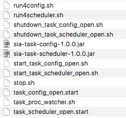
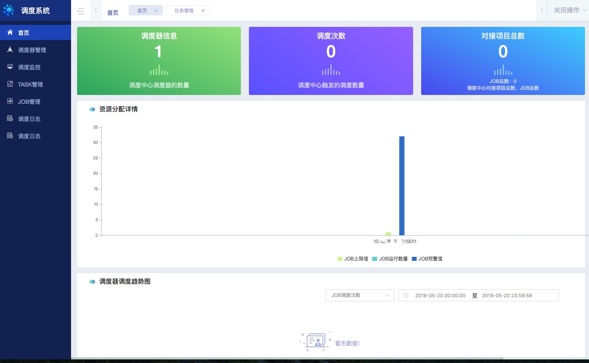

微服务任务调度平台安装部署指南
===
[容器部署指南](install-docker.md)</br>

一. MySQL初始化 
---

1. MySQL的安装和配置详见MySQL官方文档

2. 微服务任务调度平台SQL初始化脚本

```sql
-- ----------------------------
-- database sia_task
-- ----------------------------

create database IF not exists `skyworld_task`;

use skyworld_task;

-- ----------------------------
-- Table structure for skyworld_basic_job
-- job 元数据 手动录入
-- ----------------------------
create table if not exists skyworld_basic_job (
  `job_id` int(11) NOT NULL AUTO_INCREMENT,
  `job_key` varchar(255) NOT NULL COMMENT '除ID外的 唯一标识 KEY',
  `job_group` varchar(100) NOT NULL COMMENT '命名空间：name+group组成一个唯一key',
  `job_triger_type` varchar(25) DEFAULT NULL COMMENT '触发器类型',
  `job_triger_value` varchar(128) DEFAULT NULL COMMENT '触发器类型值',
  `job_desc` varchar(250) DEFAULT NULL COMMENT 'job描述信息',
  `job_alarm_email` varchar(100) DEFAULT NULL COMMENT 'job预警邮箱',
  `job_create_time` datetime NOT NULL,
  `job_update_time` datetime NOT NULL,
  `job_plan` varchar(255) DEFAULT NULL COMMENT '增加job级联类型',
  `job_parent_key` varchar(255) DEFAULT NULL COMMENT '父jobKey',
  PRIMARY KEY (`job_id`),
  UNIQUE KEY `job_key_UNIQUE` (`job_key`),
  UNIQUE KEY `job_id_UNIQUE` (`job_id`)
) ENGINE=InnoDB AUTO_INCREMENT=620 DEFAULT CHARSET=utf8
-- ----------------------------
-- Table structure for skyworld_basic_task
-- task 元数据 自动获取/手动录入
-- ----------------------------
create table if not exists skyworld_basic_task
(
  task_id            int auto_increment,
  task_key           varchar(255)     not null comment '唯一键-检索使用(AppName+HttpPath)',
  task_group_name    varchar(255)     not null comment 'task_group_name',
  task_app_name      varchar(255)     not null comment 'app_name',
  task_app_http_path varchar(255)     not null comment 'task请求路径',
  task_app_ip_port   varchar(255)     null comment 'app实例IP:port',
  param_count        int(2) default 1 null comment '是否存在入参：0：没有，1：存在',
  taskDesc           varchar(255)     null comment 'task描述',
  task_source        varchar(45)      null comment 'task来源。TASK_SOURCE_UI：手动录入，TASK_SOURCE_ZK：自动抓取',
  create_time        datetime         not null,
  update_time        datetime         null,
  constraint task_id_UNIQUE
    unique (task_id),
  constraint task_key_UNIQUE
    unique (task_key)
)
  charset = utf8;

alter table skyworld_basic_task
  add primary key (task_id);

-- ----------------------------
-- Table structure for skyworld_job_log
-- job—log 日志表，Job 调度日志
-- ----------------------------
create table if not exists skyworld_job_log (
  `job_log_id` int(11) NOT NULL AUTO_INCREMENT COMMENT '主键ID AUTO_INCREMENT',
  `job_id` int(11) DEFAULT NULL,
  `job_trigger_code` varchar(45) DEFAULT NULL COMMENT '调度-结果状态',
  `job_trigger_msg` varchar(2048) DEFAULT NULL COMMENT '调度-日志',
  `job_trigger_time` datetime DEFAULT NULL COMMENT '调度-时间',
  `job_handle_code` varchar(45) DEFAULT NULL COMMENT '执行结果-状态',
  `job_handle_msg` varchar(2048) DEFAULT NULL COMMENT '执行结果-日志',
  `job_handle_time` datetime DEFAULT NULL COMMENT '执行-时间',
  `job_handle_finished_time` datetime DEFAULT NULL COMMENT '执行完成时间',
  `create_time` datetime DEFAULT NULL,
  `trace_id` varchar(64) DEFAULT NULL,
  `job_group` varchar(255) DEFAULT NULL,
  `job_key` varchar(255) NOT NULL DEFAULT 'test_job_test',
  PRIMARY KEY (`job_log_id`),
  KEY `trace_id_index` (`trace_id`),
  KEY `job_key_index` (`job_key`),
  KEY `create_time_handle_code_group_index` (`create_time`,`job_handle_code`,`job_group`)
) ENGINE=InnoDB AUTO_INCREMENT=25803002 DEFAULT CHARSET=utf8

-- ----------------------------
-- Table structure for skyworld_portal_stat
-- sia-task 统计表，监控使用
-- @Deprecated
-- ----------------------------
create table if not exists skyworld_portal_stat
(
  portal_statistics_id int auto_increment
    primary key,
  scheduler            varchar(2048) not null comment '调度器IP:PORT',
  job_call_count       int           not null comment 'JOB调度次数',
  task_call_count      int           not null comment 'task调度次数',
  job_exception_count  int           not null comment 'JOB异常数量',
  job_finished_count   int           not null comment 'JOB已完成数量',
  task_exception_count int           not null comment 'task异常数量',
  task_finished_count  int           not null comment 'task已完成数量',
  last_time            datetime      not null comment '上次统计时间',
  create_time          datetime      not null
)
  charset = utf8;

-- ----------------------------
-- Table structure for skyworld_task_log
-- task-log 日志表，task 调度日志
-- ----------------------------
create table if not exists skyworld_task_log
(
  `task_log_id` int(11) NOT NULL AUTO_INCREMENT,
  `job_log_id` int(11) DEFAULT NULL COMMENT 'task计数',
  `job_key` varchar(255) DEFAULT NULL,
  `task_key` varchar(255) NOT NULL COMMENT 'task_id',
  `task_msg` varchar(2048) DEFAULT NULL COMMENT '状态描述信息,如：异常信息，SUCCESS等',
  `task_status` varchar(45) DEFAULT NULL COMMENT '状态值：ready,running,finished,exception',
  `task_handle_time` datetime DEFAULT NULL,
  `task_finished_time` datetime DEFAULT NULL,
  `create_time` datetime DEFAULT NULL,
  `trace_id` varchar(64) DEFAULT NULL,
  PRIMARY KEY (`task_log_id`),
  KEY `trace_id_index` (`trace_id`),
  KEY `create_time_task_status_task_key_index` (`create_time`,`task_status`,`task_key`,`job_key`)
) ENGINE=InnoDB AUTO_INCREMENT=52369829 DEFAULT CHARSET=utf8

-- ----------------------------
-- Table structure for task_mapping_job
-- 编排关系 job-task 关系表
-- ----------------------------
create table if not exists task_mapping_job
(
  `task_map_job_id` int(11) NOT NULL AUTO_INCREMENT,
  `job_id` int(11) NOT NULL,
  `job_key` varchar(255) NOT NULL,
  `job_group` varchar(255) NOT NULL,
  `task_id` int(11) NOT NULL,
  `task_key` varchar(255) NOT NULL,
  `pre_task_key` varchar(255) DEFAULT NULL COMMENT 'List',
  `input_type` varchar(255) NOT NULL DEFAULT 'from_ui' COMMENT '{from_ui,from_task}',
  `input_value` varchar(255) DEFAULT NULL COMMENT '参数值',
  `route_strategy` varchar(45) DEFAULT 'ROUTE_TYPE_RANDOM' COMMENT '路由策略{ROUTE_TYPE_FIRST,ROUTE_TYPE_RANDOM,ROUTE_TYPE_LAST,ROUTE_TYPE_ROUND}',
  `failover` varchar(45) DEFAULT NULL COMMENT '失败恢复策略',
  `fix_ip` varchar(45) DEFAULT NULL COMMENT '预估执行时间',
  `update_time` datetime DEFAULT NULL COMMENT '更新时间',
  `create_time` datetime NOT NULL COMMENT '创建时间',
  `read_timeout` int(11) DEFAULT NULL COMMENT '接口数据返回超时时间',
  PRIMARY KEY (`task_map_job_id`),
  UNIQUE KEY `uni_ind_job_task_id` (`job_key`,`job_group`,`task_key`)
) ENGINE=InnoDB AUTO_INCREMENT=1610 DEFAULT CHARSET=utf8

```

二. zookeeper安装 
---

zookeeper的安装和配置详见官方文档，至少部署三个节点。

> 如：A.B.C.2:2181, A.B.C.3:2181, A.B.C.4:2181。


三. 微服务任务调度平台前端部署
---

微服务任务调度平台采用前后分离模式，前端代码在sia-task-admin-display目录下。

### 环境准备
1. node环境安装 => https://nodejs.org/en/download/
2. Nginx准备

### 前端项目打包
进入本地的项目,在~/sia-task/sia-task-admin-display目录下执行如下命令进行前端代码打包：
- npm install 或 cnpm install(推荐) cnpm安装命令：npm install -g cnpm --registry=https://registry.npm.taobao.org
- npm run build

> 1、打包完成在当前目录下面生成dist文件夹，把dist文件夹放在nginx所在机器的app目录下 </br>
> 2、修改前端配置的编排中心应用服务地址：nginx所在机器的app目录下 dist/static文件夹下面的site.map.js为后端服务配置（ip:port形式），根据项目需求自行更改（CESHI_API_HOST参数配置的地址即为编排中心服务地址）</br>

### 前端项目部署
1. nginx的代理配置，进入nginx的目录下nginx.conf，添加如下代理：

```
server {
    listen       8080; // 前端页面监听端口
    server_name  localhost;
    location / {
        root  app/dist; // 前端包存放目录
        index  index.html index.htm;
        try_files $uri $uri/ @router;
    }
    location @router {
         rewrite ^.*$ /index.html last;
    }
    error_page   500 502 503 504  /50x.html;
    location = /50x.html {
        root   html;
    }
}

server {
    listen       80;
    server_name  localhost;
    location / {
        proxy_pass http://*.*.*.*:10615; // 后端编排中心服务地址
        add_header 'Access-Control-Allow-Origin' 'http://*.*.*.*:8080';
        add_header 'Access-Control-Allow-Credentials' 'true';
    }
}
```

四. 任务编排中心和调度中心部署 
---

1. 环境要求 </br>
	系统：64bit OS，Linux/Mac/Windows </br>
	IDE：推荐使用IntelliJ IDEA 或 Eclipse </br>
	JDK：JDK1.8+

2. 从SIA-TASK工程下获取源代码打包，执行sia-task-build-component目录的mvn命令即可。
    * 在~/sia-task/sia-task-build-component目录下，执行如下命令打包：mvn clean install 。
    * 打包成功后，会在~/sia-task/sia-task-build-component 目录下出现target文件，target文件中的.zip文件即为项目安装包。
    * 打开安装包所在文件夹，将安装包解压，得到task目录，其中包括四个子目录：
          
        * bin：存放`sia-task-admin`和`sia-task-scheduler`两个工程的jar包及各类shell脚本，如下图所示：
              
        
              
        * config：存放`sia-task-admin`和`sia-task-scheduler`两个工程的配置文件，如下图所示：
              
        
              
        * logs：存放日志
              
        * thirdparty：


3. 配置文件修改

	将config文件夹下的sia-task-config工程的配置文件task_config_open.yml，以及sia-task-scheduler工程下的配置文件task_scheduler_open.yml中的zookeeper和Mysql的链接修改为自己的地址。

4. 启动`sia-task-admin`工程
> sh start_task_admin_open.sh   

5. 启动`sia-task-scheduler`工程
> sh start_task_scheduler_open.sh

6. 访问项目

访问sia-task微服务任务调度平台的访问入口(登录页面地址（即为前端配置的编排中心服务地址），如：http://前端部署机器IP地址:8080 )。登录页面如下图所示：


* 输入用户名/用户角色即可登录（开源项目登录页面没做登录限制，输入任意字符串的用户名/用户角色都能登录),用户使用任务调度框架的时候可根据自己的需求做相应的登录权限控制开发.
* 任务调度是按角色（项目组名称）进行权限控制的，接入任务调度的应用必须以角色名称为应用名称前缀（如：角色名为"abc"，则，该角色下的应用名必须以"abc"为前缀，应用名称举例："abc-datadraw"），要求任务名称以角色名称为前缀。
* 登录时选中"是否是管理员"选项后，则会以管理员身份登录。管理员能看到所有的角色的任务，并且能手动录入角色（仅管理员有此操作的权限）。
* 用户登录任务调度系统，只能看到该用户有权限的角色（项目组）下的任务，一个用户可以有多个角色。

微服务任务调度菜单项如下图所示：



在该页面中，即可对SIA-TASK微服务任务调度的功能进行操作。

