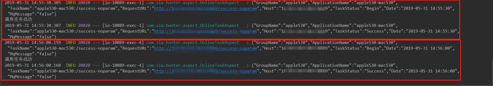

微服务任务调度平台SIA-TASK入手实践
===

引言

最近在研究开源项目微服务任务调度平台SIA-TASK，
最近微服务任务调度平台SIA-TASK开源，SIA-TASK属于分布式任务调度的平台，使用起来简单方便，非常容易入手，部署搭建好SIA-TASK任务调度平台之后，编写TASK进行调度，进而实现整个调度流程，本文通过示例来阐述一个TASK(执行器)是如何通过SIA-TASK实现任务调度的。


# 一、根据部署文档搭建任务调度平台

源码地址：https://github.com/siaorg/sia-task

官方文档：https://github.com/siaorg/sia-task/blob/master/README.md

从github上clone代码仓库并下载源码后，可根据[SIA-TASK部署指南](https://github.com/siaorg/sia-task/blob/master/DEPLOY.md)，搭建SIA-TASK任务调度平台并启动，详见[SIA-TASK部署指南](https://github.com/siaorg/sia-task/blob/master/DEPLOY.md)

# 二、根据开发文档编写TASK示例

根据[SIA-TASK开发指南](https://github.com/siaorg/sia-task/blob/master/DEVELOPGUIDE.md)，编写了两个TASK示例，本文仅使用了其中一个，具体开发规则见[SIA-TASK开发指南](https://github.com/siaorg/sia-task/blob/master/DEVELOPGUIDE.md)，TASK示例如下：

## 2.1 自动抓取任务开发代码示例
### 2.1.1. `POM`文件
```xml
  <project xmlns="http://maven.apache.org/POM/4.0.0" xmlns:xsi="http://www.w3.org/2001/XMLSchema-instance"
      xsi:schemaLocation="http://maven.apache.org/POM/4.0.0 http://maven.apache.org/xsd/maven-4.0.0.xsd">
      <modelVersion>4.0.0</modelVersion>
  
      <!-- 项目名称配置，请自定义修改 -->
      <groupId>com.creditease</groupId>
      <artifactId>onlinetask-client</artifactId>
      <version>0.0.1-SNAPSHOT</version>
      <packaging>jar</packaging>
  
      <!-- 基本配置，开始 -->
      <properties>
          <java.version>1.8</java.version>
          <project.build.sourceEncoding>UTF-8</project.build.sourceEncoding>
          <spring.boot.version>1.5.11.RELEASE</spring.boot.version>
          <spring.cloud.version>Dalston.SR5</spring.cloud.version>
      </properties>
  
      <dependencyManagement>
          <dependencies>
  
              <dependency>
                  <!-- Import dependency management from Spring Boot -->
                  <groupId>org.springframework.boot</groupId>
                  <artifactId>spring-boot-starter-parent</artifactId>
                  <version>${spring.boot.version}</version>
                  <type>pom</type>
                  <scope>import</scope>
              </dependency>
  
              <dependency>
                  <!-- Import dependency management from Spring Cloud -->
                  <groupId>org.springframework.cloud</groupId>
                  <artifactId>spring-cloud-dependencies</artifactId>
                  <version>${spring.cloud.version}</version>
                  <type>pom</type>
                  <scope>import</scope>
              </dependency>
  
          </dependencies>
      </dependencyManagement>
      <!-- 基本配置，结束 -->
  
  
      <dependencies>
          <!-- 基本依赖，开始 -->
          <dependency>
              <groupId>org.springframework.boot</groupId>
              <artifactId>spring-boot-starter</artifactId>
          </dependency>
  
          <dependency>
              <groupId>org.springframework.boot</groupId>
              <artifactId>spring-boot-starter-web</artifactId>
          </dependency>
  
          <!-- 基本依赖，结束 -->
  
          <!-- 此处添加个性化依赖 -->
          <dependency>
            <groupId>com.sia</groupId>
            <artifactId>sia-task-hunter</artifactId>
            <version>1.0.0</version>
          </dependency>
  
      </dependencies>
  
  
      <!-- 打包配置 -->
      <build>
          <resources>
              <resource>
                  <directory>src/main/resources</directory>
                  <filtering>true</filtering>
              </resource>
          </resources>
          <plugins>
              <plugin>
                  <groupId>org.springframework.boot</groupId>
                  <artifactId>spring-boot-maven-plugin</artifactId>
                  <executions>
                      <execution>
                          <goals>
                              <goal>repackage</goal>
                          </goals>
                      </execution>
                  </executions>
              </plugin>
          </plugins>
      </build>
  
  </project>
```
### 2.1.2. 配置文件
```yml
  # 项目名称（必须）
  spring.application.name: onlinetask-client
  
  # 应用端口号（必须）
  server.port: 10086
  
  # zookeeper地址（必须）
  zooKeeperHosts: *.*.*.*:2181,*.*.*.*:2181,*.*.*.*:2181
  
  # 应用上下文（可选）
  server.context-path: /
  
  # 是否开启 AOP 切面功能（默认为true）
  spring.aop.auto: true
  
  # 是否开启 @OnlineTask 串行控制（如果使用则必须开启AOP功能）（默认为true）（可选）
  spring.onlinetask.serial: true
```
### 2.1.3. `controller`
```java
package com.creditease.online.example;
  
  import java.util.HashMap;
  import java.util.Map;
  
  import org.springframework.web.bind.annotation.CrossOrigin;
  import org.springframework.web.bind.annotation.RequestBody;
  import org.springframework.web.bind.annotation.RequestMapping;
  import org.springframework.web.bind.annotation.RequestMethod;
  import org.springframework.web.bind.annotation.ResponseBody;
  import org.springframework.web.bind.annotation.RestController;
  
  import com.gantry.onlinetask.annotation.OnlineTask;
  import com.gantry.onlinetask.helper.JSONHelper;
  
  @RestController
  public class OpenTestController {

    @OnlineTask(description = "success,有入参",enableSerial=true)
    @RequestMapping(value = "/success-param", method = { RequestMethod.POST }, produces = "application/json;charset=UTF-8")
    @CrossOrigin(methods = { RequestMethod.POST }, origins = "*")
    @ResponseBody
    public String example(@RequestBody String json) {
        Map<String, String> info = new HashMap<String, String>();
        info.put("result", "success-param"+"入参是："+json);
        info.put("status", "success");
        System.out.println("调用任务成功");

        return JSONHelper.toString(info);
    }


    @OnlineTask(description = "success,无入参",enableSerial=true)
    @RequestMapping(value = "/success-noparam", method = { RequestMethod.POST }, produces = "application/json;charset=UTF-8")
    @CrossOrigin(methods = { RequestMethod.POST }, origins = "*")
    @ResponseBody
    public String example1() {
        Map<String, String> info = new HashMap<String, String>();
        info.put("result", "success-noparam");
        info.put("status", "success");
        System.out.println("调用任务成功");

        return JSONHelper.toString(info);
    }

}
```
### 2.1.4. `启动类`
```java
  package com.creditease;
  
  import org.slf4j.Logger;
  import org.slf4j.LoggerFactory;
  import org.springframework.boot.SpringApplication;
  import org.springframework.boot.autoconfigure.SpringBootApplication;
  //务必覆盖扫描包的范围
  @SpringBootApplication(scanBasePackages = { "com.sia"})
  public class OnlineTaskClientApp {
  
      private static final Logger LOGGER = LoggerFactory.getLogger(OnlineTaskClientApp.class);
  
      public static void main(String[] args) {
  
          SpringApplication.run(OnlineTaskClientApp.class, args);
          LOGGER.info("OnlineTaskClient启动！");
  
      }
  
  }
```
## 2.2 启动该TASK所在进程
启动日志如下图：


日志表明该进程正常启动且该TASK信息正常上传至ZK中


# 三、 创建、配置并激活JOB

根据[使用指南](https://github.com/siaorg/sia-task/blob/master/USERSGUIDE.md)进行如下操作：

## 3.1 观察TASK管理界面：


TASK已自动注册至ZK，并同步至数据库中


## 3.2 创建JOB，配置参数

在JOB管理界面点击`添加Job`


点击后进入`添加Job`界面


选定Job_Group,尽量选定所要关联的TASK所属的Group组名

分别填写Job类型及其他项，Job类型也可以选择FixRate(特定时间点)类型，本例为CRON类型，具体数值为：0/30 * * * * ?，表示从当前时刻开始，每30秒执行一次

点击`添加`，添加JOB成功

## 3.3 配置TASK

添加JOB成功后，需要为该JOB配置相应的TASK，可配置单个或多个，本例以配置单个TASK为例


点击`配置TASK`后，进入`Task信息配置`界面


如上图所示，将需要配置的TASK拉取至右侧，点击`编辑`按钮(铅笔形状)，进入TASK`参数配置`界面


按图中编辑完成后，点击`添加`，成功将TASK配置至JOB中，可点击`TASK信息`按钮，查看`TASK配置信息详情`，观察该JOB的TASK配置情况

`TASK配置信息图`：


`TASK配置信息详情`


## 3.4 激活JOB

TASK配置成功后，点击`状态操作`下拉按钮中`激活`按钮，激活JOB


## 3.5 观察JOB日志

成功激活JOB后，进入调度日志界面，等待至JOB执行时间后，可查看到该JOB执行日志，如下图示：


标号1：代表该JOB日志

标号2：代表该JOB所关联的TASK日志

标号3：endTask为系统追加的一个虚拟TASK，仅表示该JOB的一次调度过程完成

## 3.6 观察执行器TASK实例日志

可观察执行器实例TASK日志，验证是否调用成功



从日志可知，确实调用成功，并且每30秒调用一次

## 3.7 停止JOB

当需要停止JOB时，点击`状态操作`下拉按钮中`停止`按钮，停止JOB


本文仅是对微服务任务调度平台SIA-TASK的初步实践使用，通过以上描述，可实现SIA-TASK对执行器实例TASK实现任务调度的功能，本文中搭建的示例非常简单，适合快速入手SIA-TASK，当然，SIA-TASK还有更加强大的任务调度功能，可以应对更加复杂的业务场景，大家可以继续深度使用体验，将SIA-TASK的功能点和业务相结合，将其应用至更加复杂的业务场景之下。