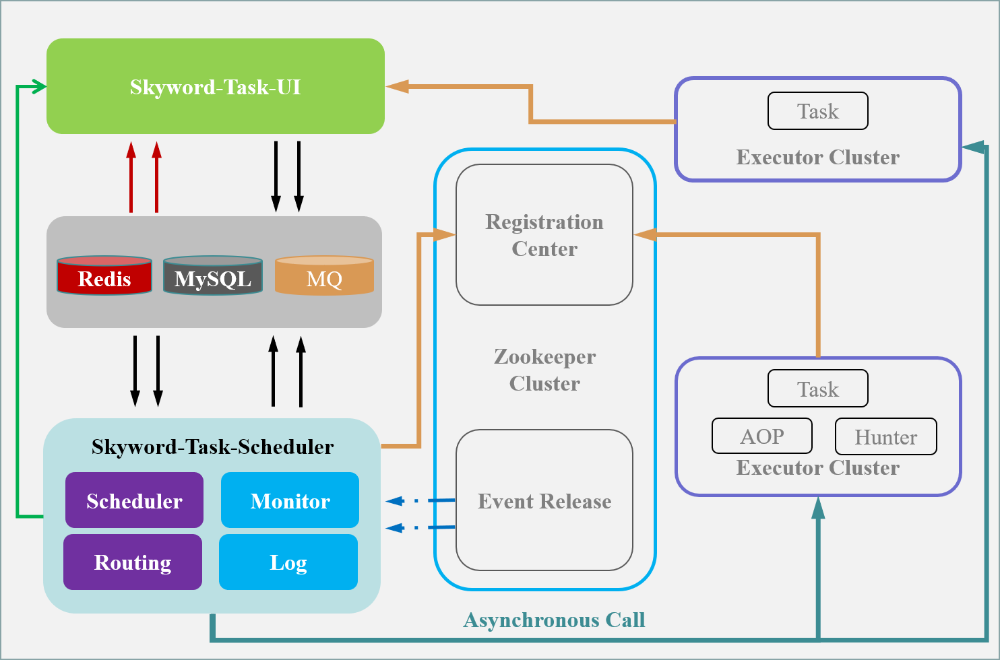
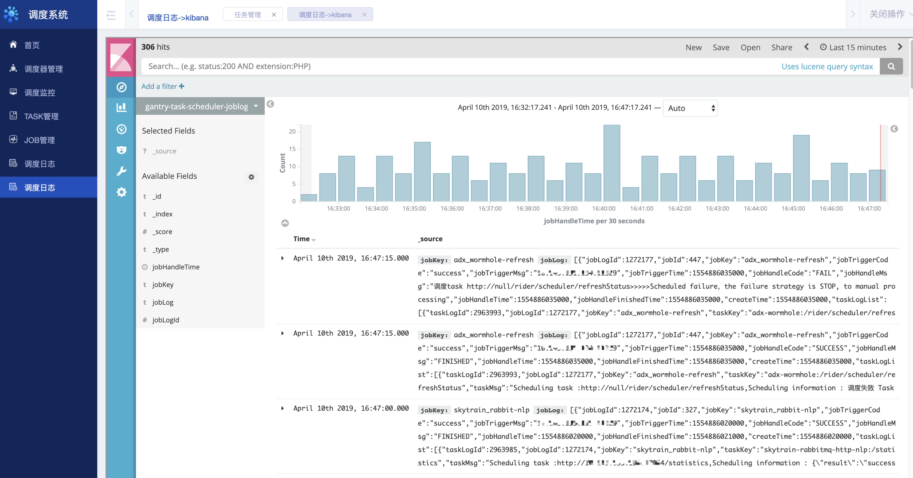

sia-task
=======
## 背景
企业应用或多或少的使用一些定时任务，不管是写在 Linux 系统 Crontab 中的定时任务，还是写在业务系统中的定时跑批，我们总会需要一些任务调度系统帮助我们解决问题。对于调度作业的开发
随着微服务化架构的逐步演进，应用逐渐由单点转向分布式协作。在分布式的背景下，单点的任务调度显然不能满足需求，于是出现了一些分布式任务调度框架。这些框架各有其特点，但仍然有不足之处，比如不支持任务编排、与业务高耦合、不支持跨平台等问题。
任务编排和业务逻辑耦合，不利于调度作业的开发和系统的维护。健壮的调度任务管理已经是非常重要的一环。
sia-task（微服务任务调度平台）项目也就应运而生，完美解决任务单点问题；sia-task采用当前主流的微服务模式，注重任务编排，而不仅仅是任务调度。sia-task 具有跨平台，可编排，高可用，无侵入，一致性，异步并行，动态扩展，实时监控等特点。

**注：本文仍在编写当中，其中部分内容非常陈旧，以后会逐步更新和完善。**

[[toc]]

## 项目简介

* 项目名称 ：sia-task
* 语言：java node.js

sia-task 专注于分布式/微服务环境下的任务调度，是任务微服务化的一体式解决方案。对于任务元数据采集，任务流编排，任务发布，以及任务全流程监控均可通过ui去完成，简单易用。对业务完全可以做到无侵入采集任务元数据、任务调度；（支持web ui）通过简单灵活的配置即可生成符合预期的任务调度模型。

## 快速开始
为了简化项目使用复杂度，我们尽可能的减少对其他组件的依赖，目前完整的sia-task包含依赖组件只需：MySQL，zookeeper; 
为了方便使用，我们提供快速部署方案，其中包含预先安装环境脚本文件，以及启动脚本，以便于提供快速使用，请参考 [使用指南](http://10.143.131.85:19010/)。

## 系统架构和原理

sia-task主要分为三个部分：任务执行器（业务具体微服务任务实例节点），调度器（触发调度组件），编排器（负责任务录入，编排，发布等），三个组件相互以zookeeper/http进行衔接。
一下是系统架构图：

## 工程说明：

sia-task是sia-task的All in One 源代码仓库。
工程模块说明如下：

### sia-task-config
* sia-task-config 主要是作为编排中心以及提供给api供sia-task-config-display（前端）使用，负责手

### sia-task-core
* sia-task-core 作为调度平台使用的基础包，其中包含封装zkClient、Mybatis以及其他通用组件。

### sia-task-hunter
* sia-task-hunter 任务（`Task`）抓取客户端，包含任务元数据自动抓取，单例单线程管控，Api鉴权。

### sia-task-scheduler
* sia-task-scheduler 调度中心。

### sia-task-config-display
* sia-task-config-display 微服务任务平台的前端，采用node.js。

## UI部分预览

首页提供多维度监控指标
* 调度器信息：展示调度器信息（负载能力，预警值），以及Job分布情况。
* 调度信息：展示调度中心触发的调度次数，Job、Task多维度调度统计。
* 对接项目统计：对使用项目的系统进行统计，Job个数，Task个数等等。

调度监控提供对已提交的Job进行实时监控展示。
* Job状态实时监控：以项目组为单位面板，展示Job运行时状态。
* 实时日志关联：可以通过涂色状态图标进行日志实时关联展示。

Task管理：提供任务（`Task`）元数据的相关操作
* Task元数据录入：手动模式的Task，可在此进行录入。
* Task连通性测试：提供Task连通性功能测试。
* Task 元数据其他操作：修改，删除。

Job管理：提供Job相关操作
* 任务编排：进行Job的任务（`Task`）流编排。
* 发布Job: Job 创建，修改，以及发布。
* 级联设置：提供存在时间依赖的Job设置。

日志管理
* 本地日志：日志界面简洁，查询快速；日志提供7天的调度日志，以供快速查询。
* 历史日志：使用Kibana 进行历史日志展示。日志存储ES中，提供历史日志可供查询。

## 文档中心

* [用户指南](http://10.143.131.85:19010/user-handbook-readme.html)

* [架构设计说明指南](http://10.143.131.85:19010/architect-readme.html)

* [安装部署指南](http://10.143.131.85:19010/install-readme.html)

## 其他说明

### 关于编译代码
* 建议使用Jdk1.8以上。

### 版本说明
* 建议版本1.0.0

### 版权说明
* 自身使用 Apache v2.0 协议

### 其他相关资料

## 关于我们

* 邮件交流：

* 提交issue:

* 微信交流：

（待补充）
* * *
返回[目录](readme) 

