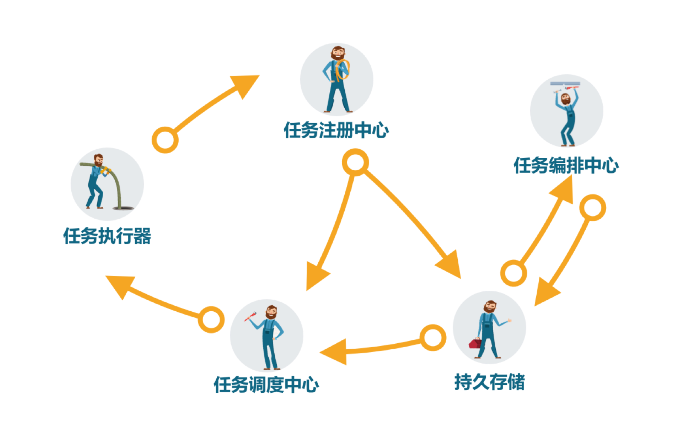
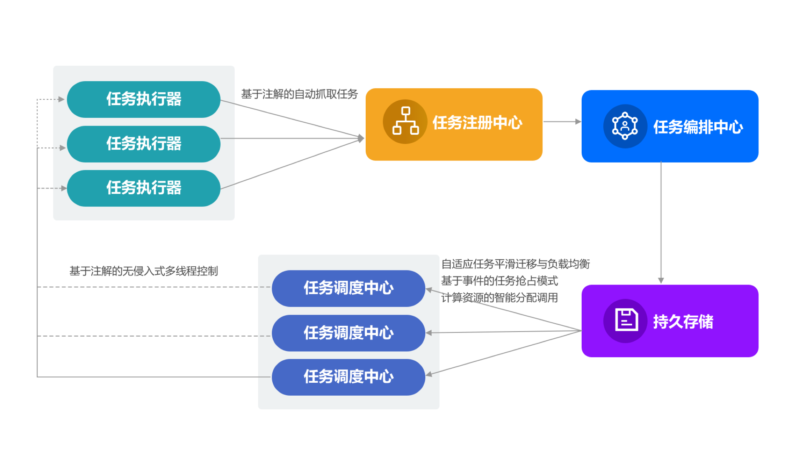
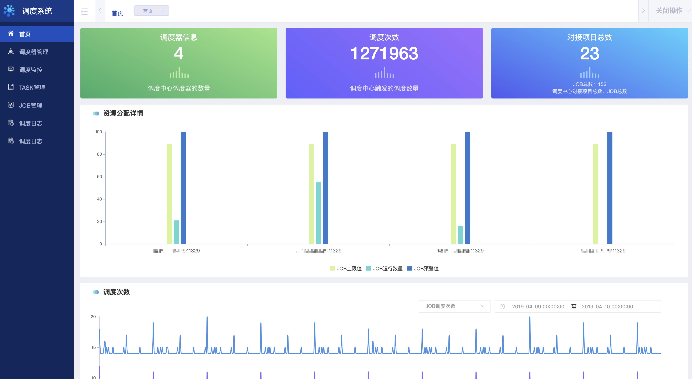
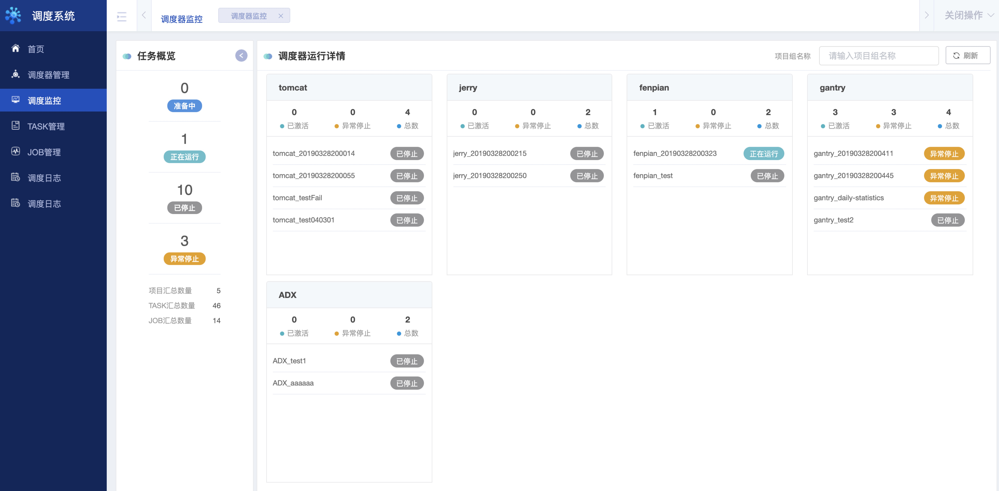
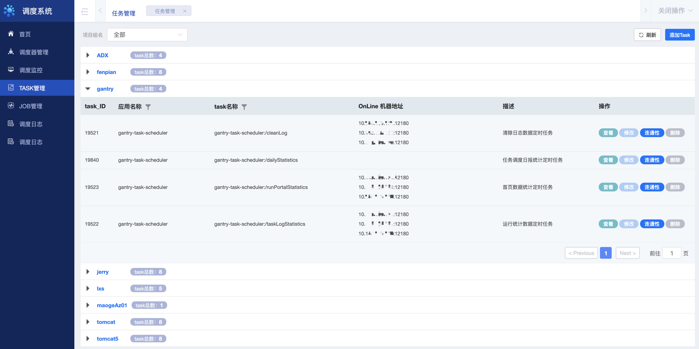
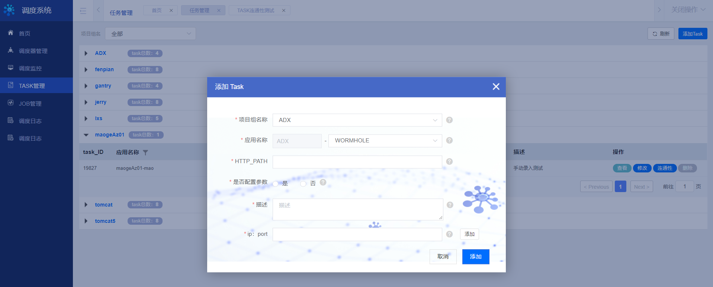
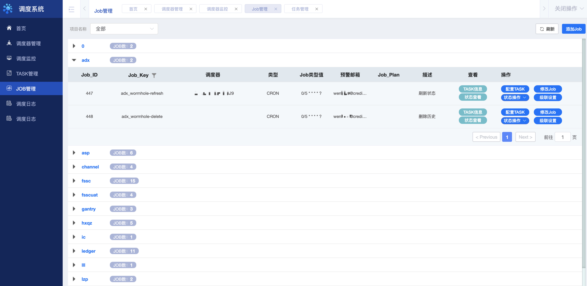
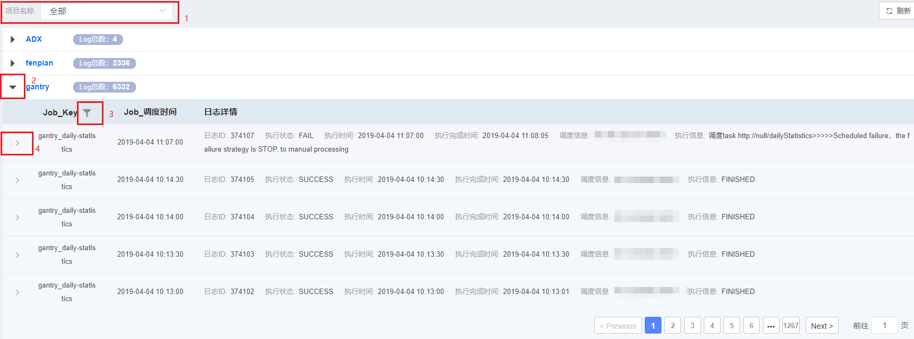

## 关于我们

* 邮件交流：sia.list@creditease.cn

* 提交issue:

* 微信交流：

    
    

微服务任务调度平台
===
[使用指南](USERSGUIDE.md)  
[开发指南](DEVELOPGUIDE.md)  
[部署指南](DEPLOY.md) 
[Demo](FASTSTART.md) 

背景
---

无论是互联网应用或者企业级应用，都充斥着大量的批处理任务。我们常常需要一些任务调度系统帮助我们解决问题。随着微服务化架构的逐步演进，单体架构逐渐演变为分布式、微服务架构。在此的背景下，很多原先的任务调度平台已经不能满足业务系统的需求。于是出现了一些基于分布式的任务调度平台。这些平台各有其特点，但各有不足之处，比如不支持任务编排、与业务高耦合、不支持跨平台等问题。不是非常符合公司的需求，因此我们开发了微服务任务调度平台（SIA-TASK）。

SIA是我们公司基础开发平台Simple is Awesome的简称，SIA-TASK（微服务任务调度平台）是其中的一项重要产品，SIA-TASK契合当前微服务架构模式，具有跨平台，可编排，高可用，无侵入，一致性，异步并行，动态扩展，实时监控等特点。

Introduction
---

A lot of batch tasks need to be processed by task scheduling systems. The single architectures are evolving towards distributed ones. We often need distributed task scheduling platforms to handle the needs of business systems. But such platforms may not support task scheduling across OS or are coupled with business features. We therefore decided to develop SIA-TASK.

SIA (Simple is Awesome) is our basic development platform. SIA-TASK is one of the key products of SIA and can work across OS. Its features include task scheduling, high availability, non-invasiveness, consistency, asynchronous concurrent processing, dynamic scale-out and real-time monitoring, etc.

项目简介
---

SIA-TASK是任务调度的一体式解决方案。对任务进行元数据采集，然后进行任务可视化编排，最终进行任务调度，并且对任务采取全流程监控，简单易用。对业务完全无侵入，通过简单灵活的配置即可生成符合预期的任务调度模型。

SIA-TASK借鉴微服务的设计思想，获取分布在每个任务执行器上的任务元数据，上传到任务注册中心。利用在线方式进行任务编排，可动态修改任务时钟，采用HTTP作为任务调度协议，统一使用JSON数据格式，由调度中心进行时钟解析，执行任务流程，进行任务通知。

Overview
---

SIA-TASK is an integrated non-invasive task scheduling solution. It collects task metadata and then visualizes and schedules the tasks. The scheduled tasks are monitored throughout the whole process. An ideal task scheduling model can be generated after simple and flexible configuration.

SIA-TASK collects task metadata on all executers and upload the data to the registry. The tasks are scheduled online using JSON with HTTP as the protocol. The scheduling center parses the clock, executes tasks and sends task notifications.

关键术语
---

* 任务（Task）: 基本执行单元，执行器对外暴露的一个HTTP调用接口;
* 作业（Job）: 由一个或者多个存在相互逻辑关系（串行/并行）的任务组成，任务调度中心调度的最小单位;
* 计划（Plan）: 由若干个顺序执行的作业组成，每个作业都有自己的执行周期，计划没有执行周期;
* 任务调度中心（Scheduler）: 根据每个的作业的执行周期进行调度，即按照计划、作业、任务的逻辑进行HTTP请求;
* 任务编排中心（Config）: 编排中心使用任务来创建计划和作业;
* 任务执行器（Executer）: 接收HTTP请求进行业务逻辑的执行;
* Hunter：Spring项目扩展包，负责执行器中的任务抓取，上传注册中心，业务可依赖该组件进行Task编写。

Terms
---

* Task: the basic execution unit and the HTTP call interface
* Job: the minimum scheduled unit that is composed of one or more (serial/concurrent) tasks
* Plan: the composition of several serial jobs with no execution cycle
* Scheduler: sends HTTP requests based on the logic of the plans, jobs and tasks
* Config: creates plans and jobs with tasks
* Executer: receives HTTP requests and executes the business logic
* Hunter: fetches tasks, uploads metadata and scripts business tasks

微服务任务调度平台的特性
---

* 基于注解自动抓取任务，在暴露成HTTP服务的方法上加入@OnlineTask注解，@OnlineTask会自动抓取方法所在的IP地址，端口，请求路径，请求方法，请求参数格式等信息上传到任务注册中心(zookeeper)，并同步写入持久化存储中，此方法即任务;
* 基于注解无侵入多线程控制，单一任务实例必须保持单线程运行，任务调度框架自动拦截@OnlineTask注解进行单线程运行控制，保持在一个任务运行时不会被再次调度。而且整个控制过程对开发者完全无感知。
* 调度器自适应任务分配，任务执行过程中出现失败，异常时。可以根据任务定制的策略进行多点重新唤醒任务，保证任务的不间断执行。
* 高度灵活任务编排模式，SIA-TASK的设计思想是以任务为原子，把多个任务按照执行的关系组合起来形成一个作业。同时运行时分为任务调度中心和任务编排中心，使得作业的调度和作业的编排分隔开来，互不影响。在我们需要调整作业的流程时，只需要在编排中心进行处理即可。同时编排中心支持任务按照串行，并行，分支等方式组织关系。在相同任务不同任务实例时，也支持多种调度方式进行处理。

Features
---

* Annotation-based automatic task fetching. Add @OnlineTask to the HTTP method. @OnlineTask would fetch and upload the IP address, port, request path, and request parameter format to the registry (Zookeeper) while writing the information into the persistent storage.
* Annotation-based non-invasive multi-threading control. The scheduler automatically intercepts @OnlineTask for single-threading control and ensures that the running task would not be scheduled again. The whole process is non-invasive.
* Self-adaptive task scheduling. Tasks can be woken up based on the custom strategies when execution failure happens.
* Flexible task configuration. SIA-TASK is designed to group several logically related tasks into a job. The Scheduler and the Config schedules and configures jobs independently. The Config allows tasks to be organized in series, concurrently or as branches. Instances of the same task can be scheduled differently.

微服务任务调度平台设计
---

SIA-TASK主要分为五个部分:

* 任务执行器
* 任务调度中心
* 任务编排中心
* 任务注册中心（zookeeper）
* 持久存储（Mysql）

SIA-TASK includes the following components:

* Executer
* Scheduler
* Config
* Registry (Zookeeper)
* Persistent storage (MySQL)

SIA-TASK的主要运行逻辑:

1. 通过注解抓取任务执行器中的任务上报到任务注册中心
2. 任务编排中心从任务注册中心获取数据进行编排保存入持久化存储
3. 任务调度中心从持久化存储获取调度信息
4. 任务调度中心按照调度逻辑访问任务执行器

SIA-TASK的主要运行逻辑:

1.	Fetch and upload annotated tasks to the registry
2.	The Config obtains data from the registry for scheduling and persistent storage
3.	The Scheduler acquires data from the persistent storage
4.	The Scheduler accesses the task scheduler following the scheduling logic

UI预览
---

首页提供多维度监控

* 调度器信息：展示调度器信息（负载能力，预警值），以及作业分布情况。
* 调度信息：展示调度中心触发的调度次数，作业、任务多维度调度统计。
* 对接项目统计：对使用项目的系统进行统计，作业个数，任务个数等等。

Homepage

* Scheduler: loading capacity, alarm value and job distribution
* Scheduling: scheduling frequency, job metrics and task metrics
* Active users: job count and task count of active users

 
调度监控提供对已提交的作业进行实时监控展示

* 作业状态实时监控：以项目组为单位面板，展示作业运行时状态。
* 实时日志关联：可以通过涂色状态图标进行日志实时关联展示。

Scheduling Monitor: real-time monitoring over submitted jobs

* Real-time job monitoring: runtime metrics of jobs by project group
* Real-time log correlation: 可以通过涂色状态图标进行日志实时关联展示。

 
任务管理：提供任务元数据的相关操作

* 任务元数据录入：手动模式的任务，可在此进行录入。
* 任务连通性测试：提供任务连通性功能测试。
* 任务元数据其他操作：修改，删除。

Task Manager: task metadata operation

* Metadata entry: enter the metadata of manual tasks
* Connectivity test: test the connectivity of tasks
* Modification and deletion

 
Job管理：提供作业相关操作

* 任务编排：进行作业的编排。
* 发布作业: 作业的创建，修改，以及发布。
* 级联设置：提供存在时间依赖的作业设置。

Job Manager: job operations

* Task configuration: configure jobs
* Job release: create, modify and release jobs
* Cascading setting: set time-dependent jobs

 
日志管理

Log Manager

开源地址
---

* [https://github.com/siaorg/sia-task](https://github.com/siaorg/sia-task)

## 其他说明

### 关于编译代码
* 建议使用Jdk1.8以上，JDK 1.8 or later version is recommended.

### 版本说明
* 建议版本1.0.0，SIA-TASK 1.0.0 is recommended.

### 版权说明
* 自身使用 Apache v2.0 协议，SIA-TASK uses Apache 2.0.

### 其他相关资料 

## SIA相关开源产品链接：

+ [微服务路由网关](https://github.com/siaorg/sia-gateway)

+ [Rabbitmq队列服务PLUS](https://github.com/siaorg/sia-rabbitmq-plus)

    
（待补充）

